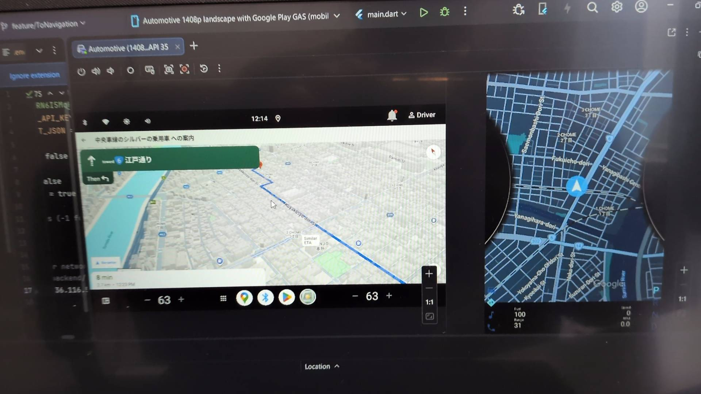
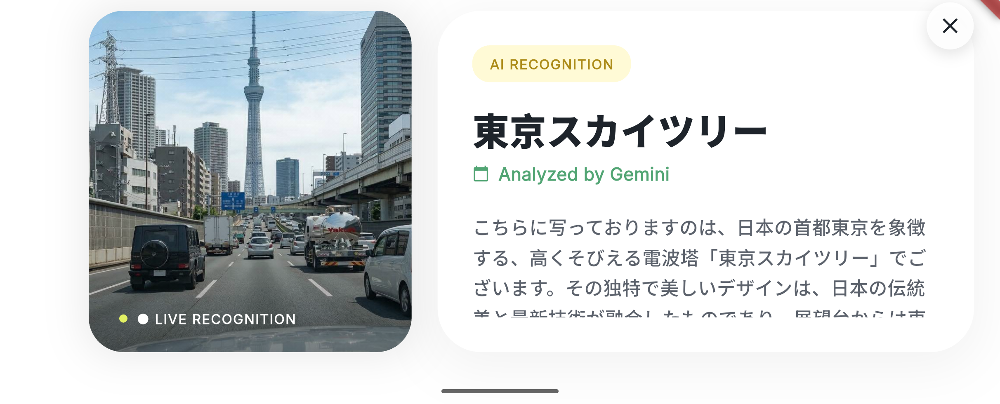
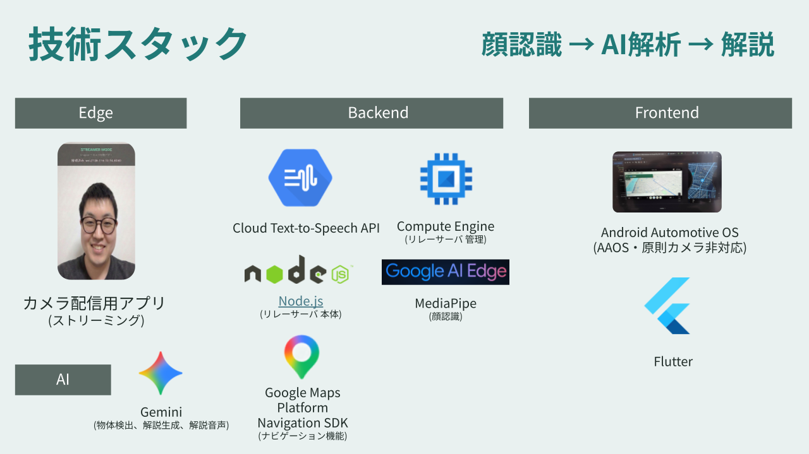

# 🧠 IMAGINE

## 📌 概要
**「見るだけで、その建物に出会えるツアーガイド」**

本アプリは、カメラ映像とAIを用いてユーザーの視線・顔を解析し、注視している建物や車の解説とナビゲーションをリアルタイムで提供する**ハンズフリーコンシェルジュ**です。

---
## 🎥 デモ
- スクリーンショット: 
### AAOS上でナビゲーションと連携した動作画面

### 視線とカメラから対象を認識し、解説する様子


### ▶ 実際に試す
IMAGINEは、CI/CDにより自動ビルドされたAPKからすぐに体験可能です。

最新のAPKはGitHub Releasesからダウンロードできます。
- 🔗 最新ビルド（APK）: [ここからダウンロード](https://github.com/GDGoC-Japan-Hackathon/imagine/releases/latest)

※本ビルドはデモ用のDebug APKです。

---

## 🎯 コア体験
1. カメラを起動
2. 顔・視線をリアルタイムで検出
3. AIが周囲の状況を解析し、ユーザーが注視している場所を特定し、検索
4. ナビゲーション・情報を提示


---

## 🧩 アーキテクチャ


### 構成
- Frontend: Flutter
- AI: Google Gemini
- Backend: MediaPipe（顔認識・物体解析）
- ネットワークカメラ通信: WebSocket
- Edge: カメラストリーミングアプリ

---

## ⚡ 技術チャレンジ
### ① AAOSでカメラが使えない問題
Android Automotiveではカメラ制約があるため、

スマートフォンを中継して映像を送信する構成を用いました。

これにより、AAOS環境でもリアルタイムな顔・目線認識を実現しました。

---

### ② Flutter × ネイティブ連携
モバイル端末でのパフォーマンスを保つため、MediaPipeを利用

MethodChannelを用いてネイティブ処理を呼び出すようにしました。

---

### ③ 組み込みデバイスへの対応
実機での適応を考慮し作成したサービスをRaspberry Pi5にて動作させました

自動車での使用を考慮しAndroid Automotive OSを選定した。その際、AOSP（Android Open Source Project）のリポジトリからソースコードを同期し、コンパイラを用いてOSの実行ファイル群のビルドを行いました。

デバイス内で、Google mapをはじめとするサービスを連携を行いました。リカバリーモードやTWRP（Team Win Recovery Project）がないため，本来GAppsが動作しないRaspberry Pi上のAndroid Automotive OS環境に対し、MindTheGappsのパッケージを解析・手動でシステムマウントし、GSF IDを発行・手動登録することで、Google Play Servicesの動作環境をゼロから構築しました。


---

## 🧠 AIの活用
- 顔認識
- 物体検出
- 状況理解（Gemini）
- ナビゲーション生成

AIを使うだけではなく、「体験設計」の中にAIを組み込めるように工夫しました。

---

## 💡 工夫した点
- ハンズフリー操作
- 視線ベースのインタラクション
- リアルタイム処理の統合

---

## 🚧 課題・改善点
- 目線の検出精度向上
- レイテンシ改善
- テスト・CI/CDの整備

---

## 🚀 今後の展望
### 産業面での活用
- 車載システム(AAOS) への応用
- 観光・ナビゲーション分野での活用
- 車と視線を通じて街の情報がつなげるシステムへの活用
-  走行中、窓越しに気になった建物を見つめると、その建物の「家賃・築年数」や「今やっているセールの情報」を知らせる活用

### 体験面での活用
- 車内カメラが乗客の表情から「退屈」を感じ取ると、車外の面白い建物や物体を紹介する体験
- 子供の「あれ何？」に車が完璧に答えて、家族とのドライブがちょっと楽しくなる体験
- ドライブの思い出を残し、ふとした瞬間に振り返れる体験


---

## 👥 チーム
- ハトさん (@hatomaru)
- コータ (@Kotaamano2005)

---

## ⚙ セットアップ（簡易）
### Frontend
```bash
cd frontend/imagine
flutter pub get
flutter run
```


### Streamer
```bash
cd edge/streamer_app
flutter pub get
flutter run
```

### RelayServer
```bash
cd backend
npm install ws
node relay.js
```
